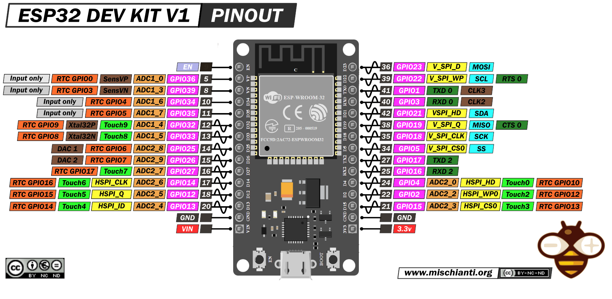
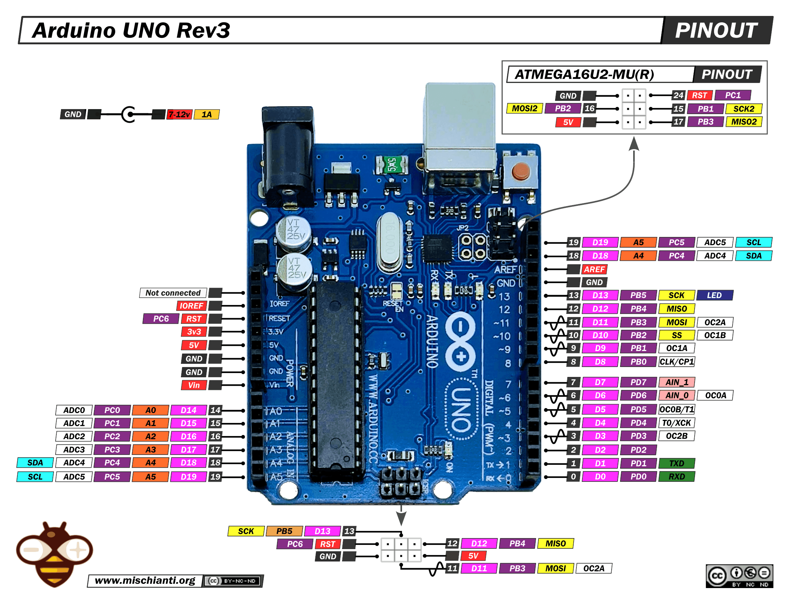
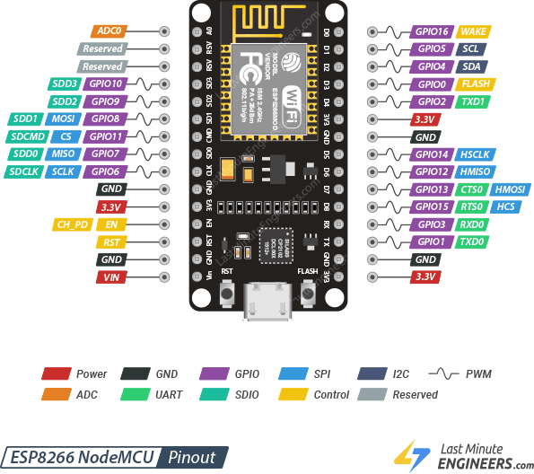
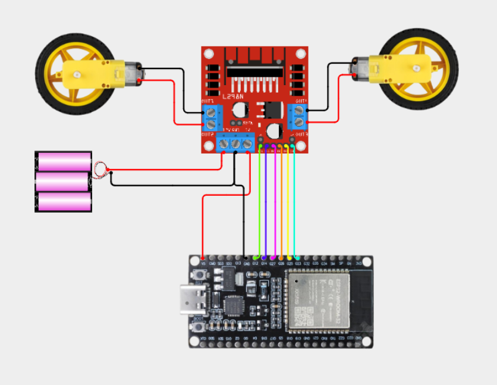
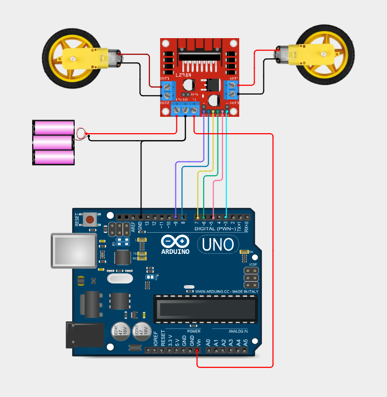
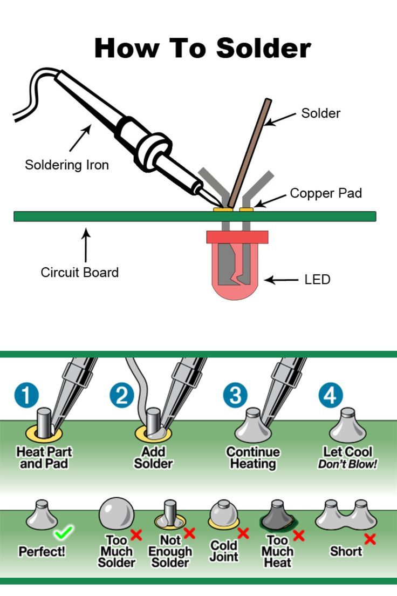

<div align="center">

# 🤖 Pertemuan 1 — Hardware, Perakitan & Coding Basic

[]()
[]()
[]()

</div>

---

## 🎯 Yang Akan Kamu Pelajari

- [x] Mengenal & membandingkan ESP32, Arduino UNO, dan ESP8266
- [x] Membaca dan memahami pinout diagram board
- [x] Teknik soldering & wiring yang benar
- [x] Install Arduino IDE + board ESP32
- [x] Upload program pertama ke ESP32
- [x] Menggerakkan motor DC lewat L298N

---

## 🧠 Perbandingan Board

| Fitur | Arduino UNO Rev3 | ESP8266 NodeMCU | ESP32 Dev Kit V1 |
|---|---|---|---|
| Processor | ATmega328P 8-bit | Tensilica L106 32-bit | Xtensa LX6 Dual-core 32-bit |
| Clock | 16 MHz | 80–160 MHz | **240 MHz** |
| RAM | 2 KB | 50 KB | **520 KB** |
| Flash | 32 KB | 1–4 MB | **4 MB** |
| WiFi | ❌ | ✅ | ✅ |
| Bluetooth | ❌ | ❌ | ✅ **BLE + Classic** |
| PWM Pins | 6 | Hampir semua | **Semua GPIO** |
| Tegangan I/O | 5V | 3.3V ⚠️ | 3.3V ⚠️ |
| Harga kisaran | ~Rp 50rb | ~Rp 45rb | ~Rp 70rb |
| **Digunakan di workshop** | Referensi | Referensi | ✅ **Board Utama** |

> 💡 **Kenapa ESP32?** Karena ESP32 sudah ada WiFi + Bluetooth untuk kontrol wireless. ESP32 adalah satu board yang cover semua kebutuhan projek ini.

---

## 📌 Pinout Reference

### ESP32 Dev Kit V1 ← Board yang kita pakai



> ⚠️ **Pin yang HARUS dihindari:**
> - `GPIO0` → Boot mode selector
> - `GPIO6–11` → Terhubung ke flash internal, jangan dipakai!
> - `GPIO34, 35, 36, 39` → Input only, tidak bisa output

---

### Arduino UNO Rev3 — Referensi



**Perbedaan utama vs ESP32:**
- Pin digital `D0–D13`, analog `A0–A5`
- PWM hanya di pin bertanda `~` : `3, 5, 6, 9, 10, 11`
- Beroperasi di **5V** — lebih toleran terhadap noise
- Tidak ada WiFi/Bluetooth

---

### ESP8266 NodeMCU — Referensi WiFi Murah



**Catatan jika pakai ESP8266:**
- Semua GPIO beroperasi di **3.3V**
- Hanya 1 pin ADC (`A0`) dengan range 0–1V
- Tidak ada Bluetooth
- PWM menggunakan `analogWrite()` seperti Arduino
- Pin `GPIO6–11` juga terhubung ke flash, jangan dipakai

---

## 🔌 Wiring Diagram — ESP32 + L298N


## 🔌 Wiring Diagram — Arduino UNO + L298N


## 🔧 Panduan Soldering

> ⚠️ **Safety first!** Pakai di area berventilasi. Jangan pegang ujung solder panas (±350°C)!

### Langkah Soldering yang Benar

```
STEP 1         STEP 2             STEP 3             STEP 4
Panaskan  ──►  Posisikan     ──►  Sentuh        ──►  Tempel
solder         komponen           solder ke          timah ke
               di tempatnya       JOINT (bukan       joint hingga
                                  ke timah!)         mengalir
```

### ✅ Hasil Baik vs ❌ Hasil Buruk



**Tips tambahan:**
- Jangan terlalu lama tempel solder (max 3 detik per titik)
- Timah yang terlalu banyak = short circuit
- Timah yang terlalu sedikit = koneksi buruk
- Bersihkan ujung solder dengan spons/kawat secara berkala
- Gunakan flux jika timah tidak menempel

---

## 💻 Setup Arduino IDE untuk ESP32

### Step 1 — Install Arduino IDE 2.x
> Download: **https://www.arduino.cc/en/software**

### Step 2 — Tambah URL Board ESP32

```
File → Preferences
```

Di kolom **"Additional boards manager URLs"**, paste:
```
https://raw.githubusercontent.com/espressif/arduino-esp32/gh-pages/package_esp32_index.json
```

### Step 3 — Install Board Package

```
Tools → Board → Boards Manager → Cari: esp32
→ Install: "esp32 by Espressif Systems"
```

> ⏳ Ukuran sekitar 200MB, sabar ya!

### Step 4 — Pilih Board & Port

```
Tools → Board → ESP32 Arduino → ESP32 Dev Module
Tools → Port  → COM5 (Windows) | /dev/ttyUSB0 (Linux) | /dev/cu.SLAB... (Mac)
```

> 💡 **Port tidak muncul?** Install driver sesuai chip USB di boardmu:
> - **CP2102**: https://www.silabs.com/developers/usb-to-uart-bridge-vcp-drivers
> - **CH340**: https://sparks.gogo.co.nz/ch340.html

### Step 5 — Test Upload

Sebelum upload, **perhatikan dua tombol di ESP32:**

```
   ┌─────────────────────────┐
   │        ESP32            │
   │                         │
   │  [EN / RST]  [BOOT]     │
   │     Reset    Upload     │
   └─────────────────────────┘
```

Jika muncul error `Failed to connect to ESP32`:
1. Klik **Upload** di Arduino IDE
2. Tunggu hingga muncul teks `Connecting........`
3. **Tekan & tahan tombol BOOT**
4. Lepas saat progress bar upload mulai berjalan

---

## 📁 Sketsa Program — Pertemuan Ini

### [01 — Blink LED](./01_blink_led/01_blink_led.ino)

Program pertama — kedipkan built-in LED di GPIO2.

```cpp
// Esp32 
int enA = 13, inA1 = 12, inA2 = 14, speedA = 255;
int enB = 25, inB1 = 27, inB2 = 26, speedB = 150;

void setup() {
  pinMode(enA, OUTPUT);
  pinMode(inA1, OUTPUT);
  pinMode(inA2, OUTPUT);
  pinMode(enB, OUTPUT);
  pinMode(inB1, OUTPUT);
  pinMode(inB2, OUTPUT);
}

void loop() {
  maju();
  delay(3000);

  kanan();
  delay(1500);

  maju();
  delay(3000);

  kiri();
  delay(1500);

  mundur();
  delay(2000);

  stopMotor();
  delay(2000);
}

// ================= GERAKAN =================

void maju() {
  digitalWrite(inA1, HIGH);
  digitalWrite(inA2, LOW);
  analogWrite(enA, speedA);

  digitalWrite(inB1, LOW);
  digitalWrite(inB2, HIGH);
  analogWrite(enB, speedB);
}

void mundur() {
  digitalWrite(inA1, LOW);
  digitalWrite(inA2, HIGH);
  analogWrite(enA, speedA);

  digitalWrite(inB1, HIGH);
  digitalWrite(inB2, LOW);
  analogWrite(enB, speedB);
}

void kanan() {
  digitalWrite(inA1, LOW);
  digitalWrite(inA2, HIGH);
  analogWrite(enA, speedA);

  digitalWrite(inB1, LOW);
  digitalWrite(inB2, HIGH);
  analogWrite(enB, speedB);
}

void kiri() {
  digitalWrite(inA1, HIGH);
  digitalWrite(inA2, LOW);
  analogWrite(enA, speedA);

  digitalWrite(inB1, HIGH);
  digitalWrite(inB2, LOW);
  analogWrite(enB, speedB);
}

void stopMotor() {
  analogWrite(enA, 0);
  analogWrite(enB, 0);
}

```

## 🏋️ Latihan Mandiri

| # | Latihan | Hint |
|---|---|---|---|
| 1 | Robocar: maju 2s → belok kiri → maju 2s → belok kanan → stop | Kombinasi fungsi motor |
| 2 | Akselerasi halus: speed naik 0→200 lalu turun 200→0 | Atur kecepatannya |

---

## ❓ Troubleshooting

<details>
<summary><b>🔴 ESP32 tidak terdeteksi di komputer (port tidak muncul)</b></summary>

Install driver sesuai chip USB di boardmu. Cek teks kecil di dekat port USB:
- Tulisan **CP2102** → install di: https://www.silabs.com/developers/usb-to-uart-bridge-vcp-drivers
- Tulisan **CH340** → install di: https://sparks.gogo.co.nz/ch340.html

Setelah install driver, cabut & pasang ulang kabel USB, lalu cek Arduino IDE.

</details>

<details>
<summary><b>🔴 Error "Failed to connect to ESP32" saat upload</b></summary>

ESP32 perlu masuk mode bootloader secara manual:
1. Klik tombol **Upload** di Arduino IDE
2. Tunggu hingga muncul teks `Connecting........_____`
3. **Tekan & tahan tombol BOOT** di board ESP32
4. Lepas tombol BOOT saat progress bar upload mulai berjalan

</details>

<details>
<summary><b>🟡 Serial Monitor menampilkan karakter aneh / tidak terbaca</b></summary>

Baud rate tidak cocok. ESP32 menggunakan **115200**, bukan 9600.

Di Serial Monitor (kanan bawah), ubah dropdown dari `9600 baud` ke **`115200 baud`**.

</details>

<details>
<summary><b>🟡 Board ESP32 tidak muncul di menu Tools → Board</b></summary>

Board belum ter-install. Ulangi langkah:
1. `File → Preferences` → pastikan URL Espressif sudah ada
2. `Tools → Board → Boards Manager` → cari "esp32"
3. Pastikan yang di-install adalah **"esp32 by Espressif Systems"** (bukan yang lain)

</details>

<details>
<summary><b>🔴 Motor tidak bergerak sama sekali</b></summary>

Cek berurutan:
1. **Tegangan baterai** cukup? (min 6V untuk L298N)
2. **Kabel IN1–IN4** terhubung ke GPIO yang benar? (27, 26, 25, 33)
3. **Jumper ENA & ENB** di L298N sudah dilepas? (wajib jika pakai pin PWM)
4. **GND ESP32** dan **GND L298N** tersambung ke ground yang sama?
5. **5V L298N** tersambung ke VIN ESP32?

</details>

<details>
<summary><b>🟡 Motor bergerak terbalik (maju malah mundur)</b></summary>

Polaritas motor terbalik. Dua solusi:

**Solusi hardware** (lebih mudah): Tukar kabel OUT1 ↔ OUT2 di L298N untuk motor kiri, atau OUT3 ↔ OUT4 untuk motor kanan.

**Solusi software**: Tukar logika `HIGH/LOW` di fungsi `maju()` untuk motor yang terbalik.

</details>

<details>
<summary><b>🔴 ESP32 restart terus / bootloop</b></summary>

Kemungkinan GPIO0 tertarik ke GND. Pastikan tidak ada kabel yang nyambung ke GPIO0 saat ESP32 boot. GPIO0 dipakai secara internal untuk menentukan mode boot.

</details>

---

## 📚 Referensi

- 📖 [Arduino Language Reference](https://www.arduino.cc/reference/en/)
- 📖 [ESP32 Arduino Core — Espressif](https://docs.espressif.com/projects/arduino-esp32/en/latest/)
- 📖 [ESP32 Dev Kit V1 Pinout — mischianti.org](https://www.mischianti.org/2021/07/17/esp32-devkitc-v4-esp-wroom-32-high-resolution-pinout-and-specs/)
- 📖 [Arduino UNO Rev3 Pinout — mischianti.org](https://www.mischianti.org/2020/10/03/arduino-uno-rev3-high-resolution-pinout-and-specs/)
- 📖 [ESP8266 NodeMCU Pinout — lastminuteengineers.com](https://lastminuteengineers.com/esp8266-nodemcu-arduino-tutorial/)
- 📖 [L298N Motor Driver Guide](https://lastminuteengineers.com/l298n-dc-stepper-driver-arduino-tutorial/)

---

<div align="center">

*[⬆ Kembali ke Halaman Utama](../README.md)*

</div>
